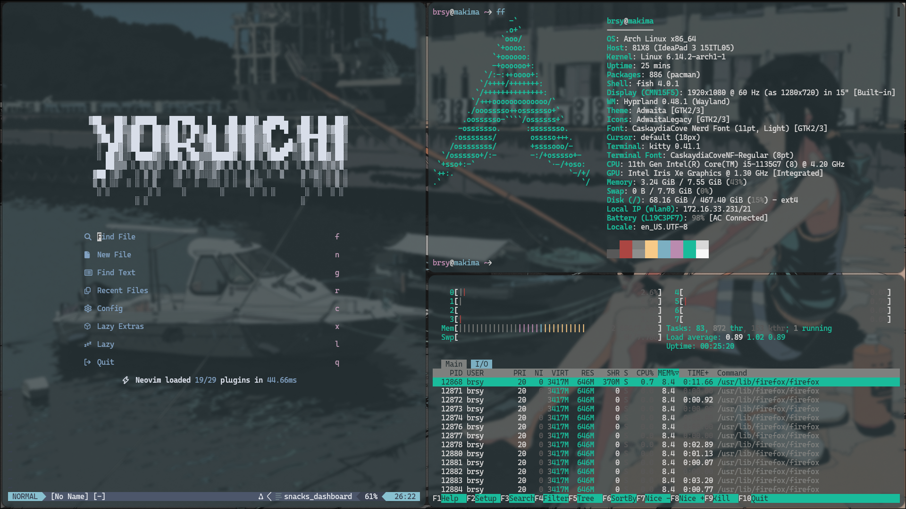

# Dotfiles

These are all my dotfiles that are stable at the moment. \
I am using macOS with nix-darwin right now. \
Other dots are stable and working fine. \
Please be sure you have some basic knowledge of how things work before cloning to avoid issues.


## Macos setup


```sh
sudo darwin-rebuild switch --flake github:briheet/nix-config#makima
```

#### WallCodeS (Wallpaper, Vscode, Scripts)
``` bash
git clone --branch wallcodes --single-branch https://github.com/briheet/dotfiles.git
```

## Old Setup

### Plain Desktop



### SDDM


### GRUB


### Desktop Wallpaper


