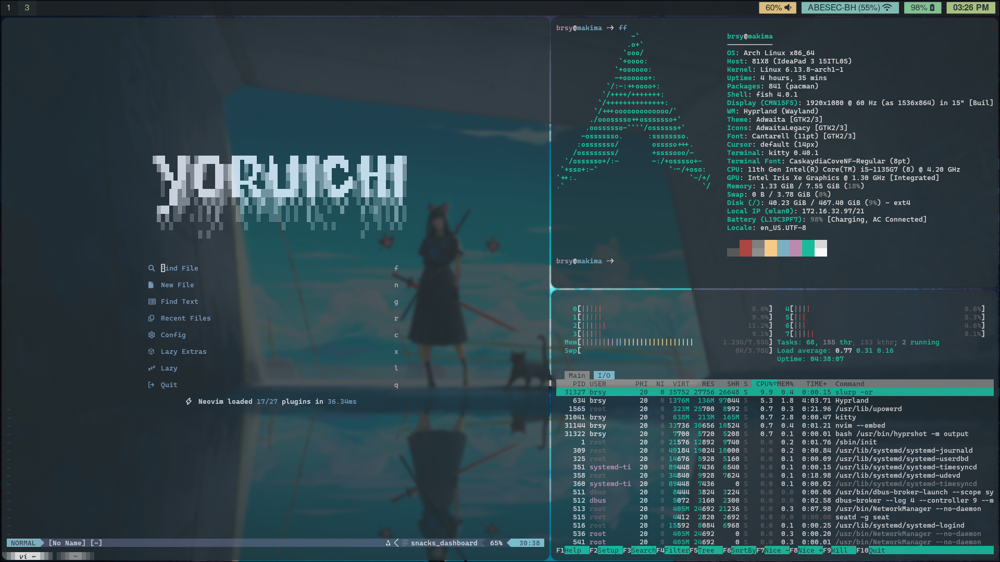

# Dotfiles

these are my current nix configs; \
these include m4pro, x86-64vm, nixos-anywhere config;

## Setup

To use nix-darwin, use `makima`; also read this [article](https://www.briheet.com/blogs/nix-darwin-home-manager/)
```bash
sudo darwin-rebuild switch --flake github:briheet/nix-config#makima
```

To install nixos on vm and use it via home manager, check `vm` and `zangetsu`;
```bash
# Install nixo-anywhere on vm. First add pub key in nix-config/systems/hetzner/secrets.txt
nix run github:nix-community/nixos-anywhere -- --build-on remote --flake .#vm --target-host zangetsu

# Then rebuild vm via home manager
nix run nixpkgs#nixos-rebuild -- --flake .#zangetsu --build-host zangetsu --target-host zangetsu switch
```

## Macos setup


## Old Setup

### Plain Desktop



### SDDM


### GRUB


### Desktop Wallpaper


